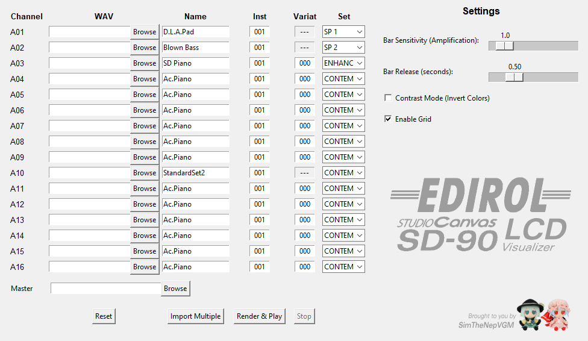
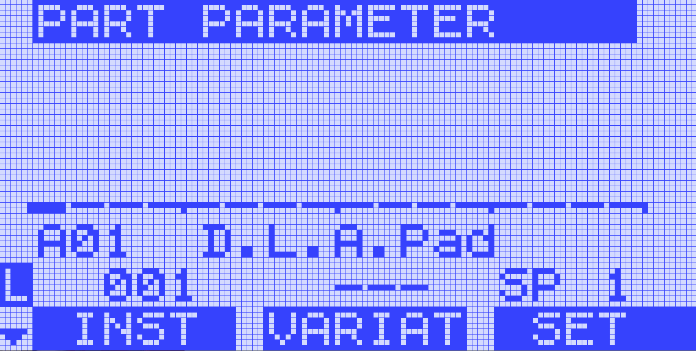
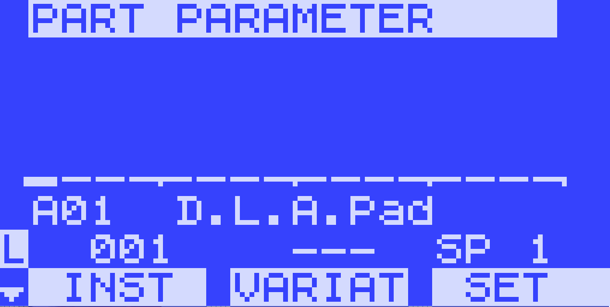

<div align="center">
  
  <p>The Edirol StudioCanvas Visualizer</p>
</div>

## Description
The [SoundCanvas](https://en.wikipedia.org/wiki/Roland_Sound_Canvas) line, introduced by Roland in the early 1990s, became a popular series of MIDI sound modules known for their high-quality General MIDI and Roland GS-compatible sounds. These modules were widely used by musicians and producers for their rich sound in an era when computers couldn't handle demanding audio processing, establishing SoundCanvas as a staple in **MS-DOS** music production.

Building on this success, Roland released the [StudioCanvas](https://en.wikipedia.org/wiki/Roland_Sound_Canvas#Studio_Canvas) series, which offered enhanced features and improved sound quality tailored for professional studio environments. The StudioCanvas modules introduced more advanced effects, higher fidelity sound engines based on the [Roland XV-5080](https://www.vintagesynth.com/roland/xv-5080), and additional user controls, making them a preferred choice for detailed sound design and complex MIDI setups.

<p></p>
<div align="center">
  
  <p>The first StudioCanvas module, the SD-90</p>
</div>
<p></p>

The module the program looks to emulate, a 2001 **Edirol SD-90**, was heavily popularized for its usage in the **Touhou Project**, an old indie-game franchise by developed **ZUN**, which is what sparked the determination to finish this lenghty project.

Development of this software started over a year ago with the goal of emulating the LCD screen and bar meters pixel-by-pixel, due to the lack of good Windows-compatible SoundCanvas LCD displays, let alone StudioCanvases.
It's a simple Python program, based on [corrscope](https://github.com/corrscope/corrscope), with a 127x64 pixel grid and the SD-series pixelated text font. It uses tkinter and pygame to accomplish this, featuring two unique interface styles that emulate the different modes in the module's display.

<div align="center">
  
  <p>The program in action</p>
</div>

## Installation Guide

### Dependencies

| Dependency | Description               | Install Command                |
|------------|---------------------------|-------------------------------|
|  `Python`     | Programming language           | [Download Python](https://www.python.org/downloads/) |
|  `tkinter`   | GUI toolkit                   | Usually pre-installed           |
|  `pygame`      | Multimedia library            | `pip install pygame`            |
|  `soundfile`| Audio file input/output       | `pip install soundfile`         |
|  `numpy`           | Numerical computing           | `pip install numpy`             |
|  `scipy`           | Scientific computing          | `pip install scipy`             |

You can use the SD-LCD project in two ways: either by running the Python script directly from the repository or by downloading a pre-built release from the [Releases page.](https://github.com/SimTheNep/SD-LCD/releases)

### 1. Running from Source (Build from Repository)

1. **Clone or download** this repository to your local machine.
   
   ```bash
    # Clone the repository
    git clone https://github.com/SimTheNep/SD-LCD.git

    # Change to the project directory
    cd SD-LCD

3. Make sure you have **Python 3.7+** installed. You can download it from [python.org](https://www.python.org/downloads/).
4. Install the required dependencies by running the following command in your terminal or command prompt:

   ```bash
   pip install pygame soundfile numpy scipy
* tkinter usually comes pre-installed with Python on Windows and macOS.
* If you're on Linux and tkinter is missing, install it via your package manager, for example:
  
    ```bash
    sudo apt install python3-tk
    
4. Run the main script:
   
    ```bash
    python SD-LCD.py
5. (UNIX-based users) make it executable:

   ```bash
    chmod +x SD-LCD.py
    ./SD-LCD.py
  
### 2. Using the Pre-built Release

1. Go to the [Releases page.](https://github.com/SimTheNep/SD-LCD/releases)
2. Download the latest release ZIP file.
3. Extract the ZIP file anywhere on your system.
4. Run SD-LCD.exe by double-clicking it or by running SD-LCD.py from a terminal.

## Usage
For those unfamiliar with the module, it posesses five instrument sets (Special 1, Special 2, Classical, Contemporary, Solo and Enhanced) for each of the Roland GS MIDI Patches. Channel A10 is reserved for drum kits in the MIDI standard and in the SD-90 the first three channels are reserved for insertion effects (MFX A, B and C), which are applied by default if any preset containing one is selected on those channels. You can read more about the specifications of the hardware in the official [owner's manual](https://static.roland.com/assets/media/pdf/SD-90_OM.pdf).
<table style="width: 100%;">
  <tr>
    <td style="vertical-align: top; padding-right: 1em; width: 50%; max-width: 50%;">
      <p>To get started with the SD-LCD, you must insert up to 16 .WAV files in the desired channels (A01-A16) and choose a master audio. This master audio will be the only one that will be played back in the final render.</p>
      <p>There are 4 parameters to be inserted for each channel:</p>
      <ul>
        <li>Instrument Name</li>
        <li>MIDI Patch Number</li>
        <li>MIDI Patch Variant</li>
        <li>SD-90 Instrument Set</li>
      </ul>
      <p>The SD-LCD has the following options for rendering:</p>
      <ul>
        <li>Slider to adjust the meter sensitivity</li>
        <li>Slider to adjust the meter decay</li>
        <li>Contrast ON/OFF</li>
        <li>Grid ON/OFF</li>
      </ul>
      <p>Upon entering render mode, you can select the different channels, displaying their information, with the left and right arrow keys.</p>
    </td>
    <td style="vertical-align: top; width: 50%; max-width: 50%;">
      <div style="margin-bottom: 1em;" align="center">
        
        <p>The configuration<p>
      </div>
      <div style="margin-bottom: 1em;" align="center">
        
        <p>LCD display with the grid enabled</p>
      </div>
      <div align="center">
        
        <p>LCD display in contrast mode with the grid disabled</p>
      </div>
    </td>
  </tr>
</table>

**A list with all the presets and respective parameters is available** [here](https://github.com/SimTheNep/SD-LCD/blob/main/patches.pdf).

## Demos
### Psst... hey... did you know I have my own Touhou Sound Sources sheet, dedicated to documenting old ZUN music from 1999-2002? [Check it out!](https://tinyurl.com/VintageTouhouSheet)
W.I.P...

